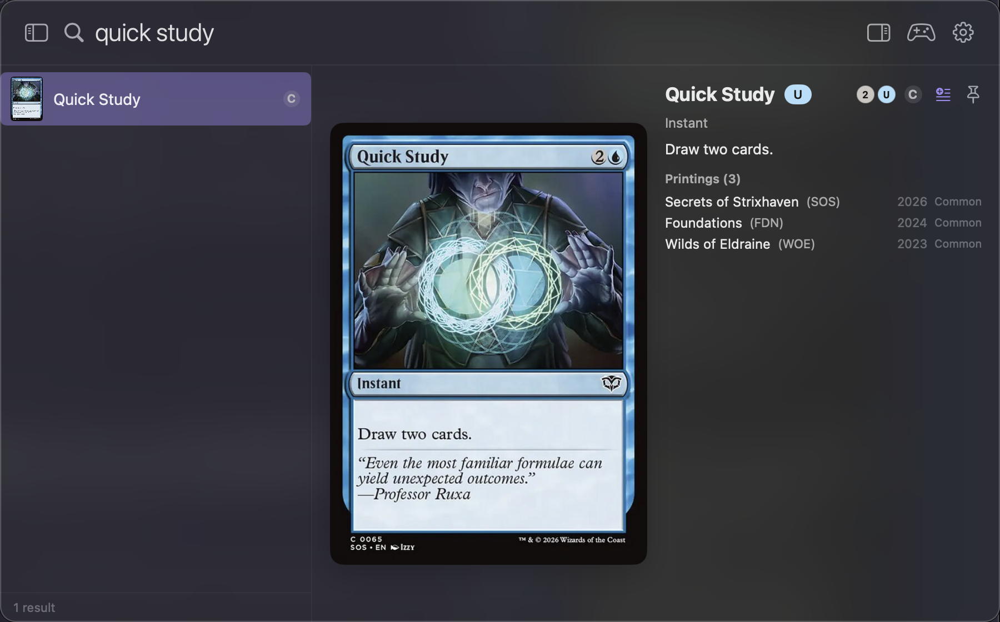
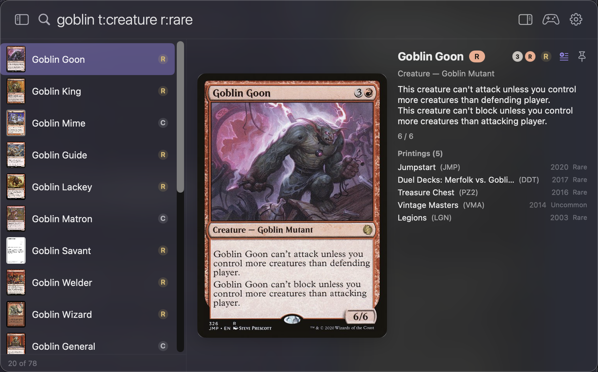
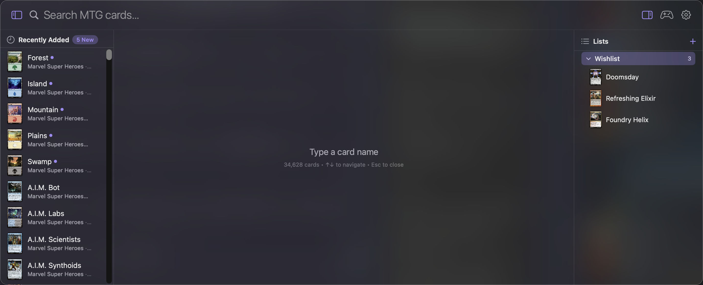
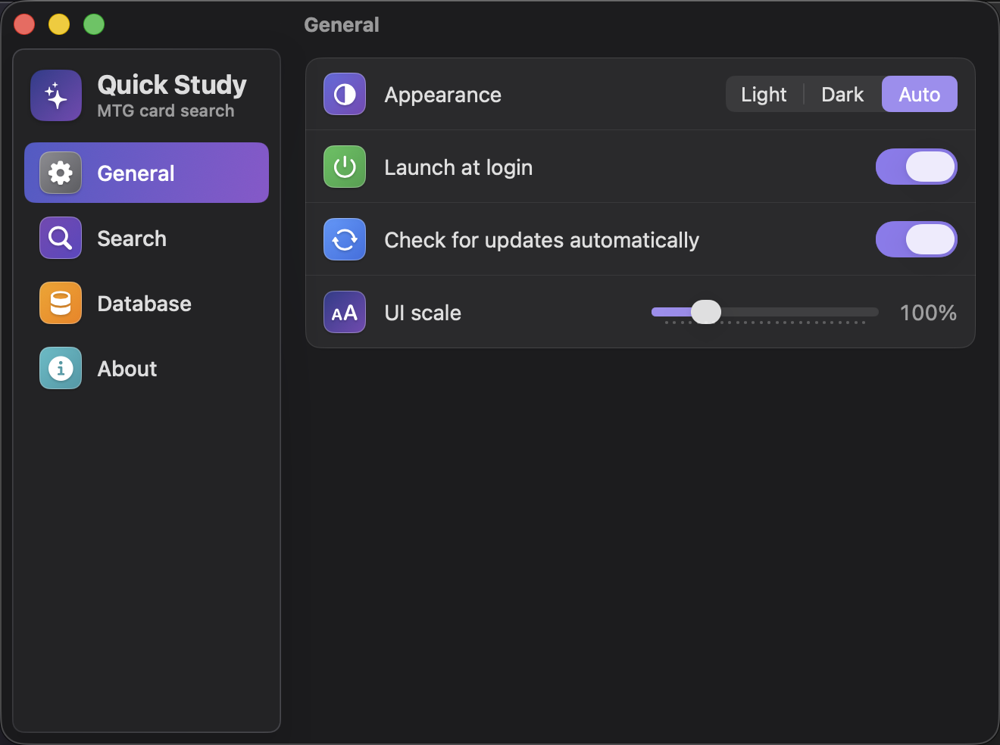
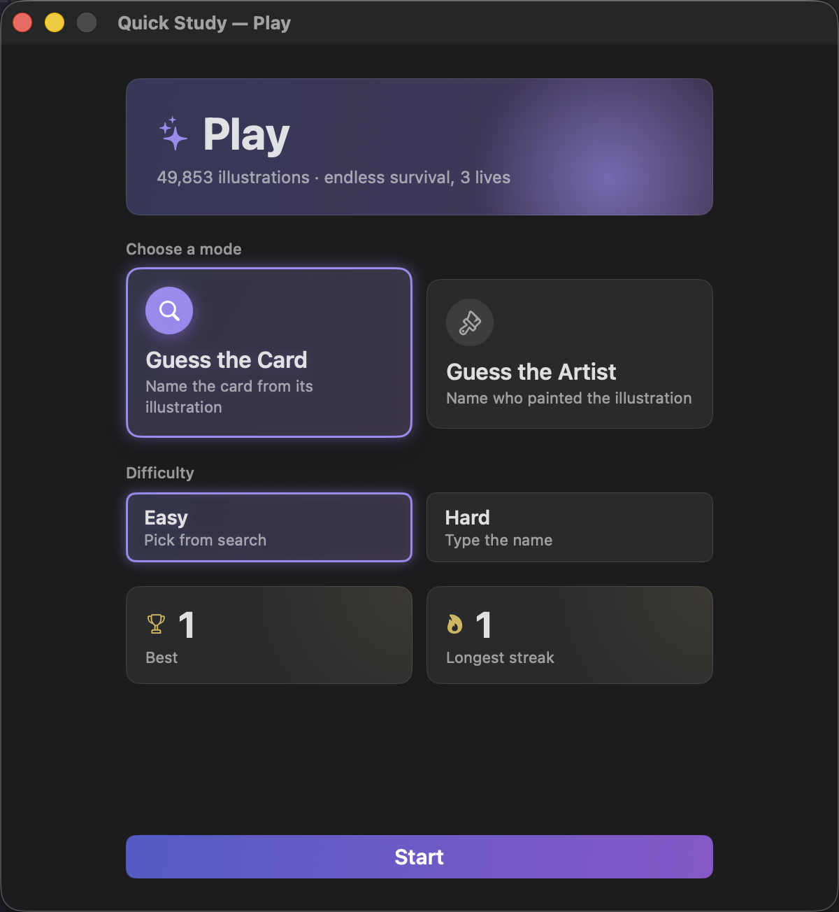
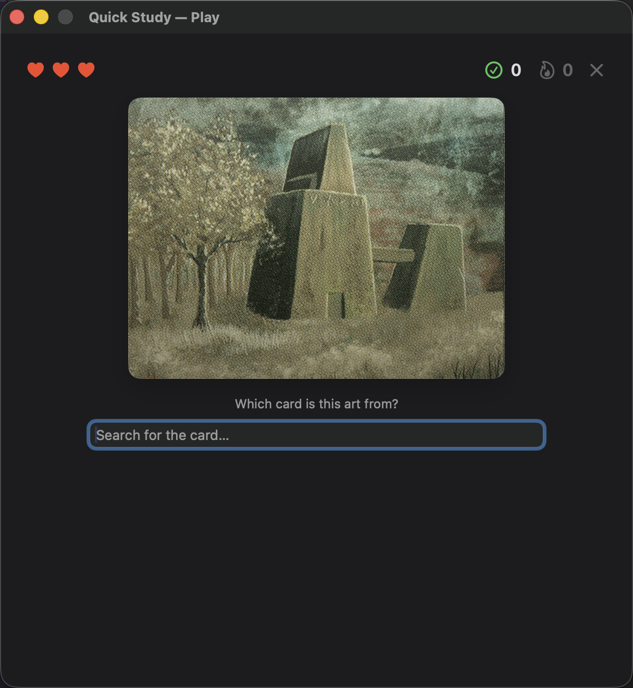

# Quick Study

A local-first, Spotlight-style Mac app for looking up Magic: The Gathering cards. Press a global hotkey, type a partial name, see a ranked list with a full image + text preview — all served from a local SQLite database and on-disk image cache.

Named after [Quick Study](https://scryfall.com/search?q=%21%22Quick+Study%22), the blue Strixhaven instant.

Data is sourced from [Scryfall](https://scryfall.com/docs/api)'s free bulk-data API. No scraping, no subscriptions.


## Features

- **Fuzzy name search** — sub-millisecond, in-memory ranking over ~25k cards. Layered scoring (exact → prefix → word-start → substring → initials) so short, exact names win on ambiguous queries.
- **Scryfall-style inline filters** — narrow results with `r:rare`, `t:creature`, `c:r`, `mv>=3`, `o:"draw a card"` right in the search box. Combine them, mix with a name, and negate with a leading `-` (e.g. `goblin t:creature -t:legendary`).
- **Search by set** — type a three-letter set code (e.g. `MSC`) or a set name (e.g. `Modern Horizons`) to surface that set's cards. An exact set code is a strong signal but still loses to a card whose name matches.
- **Image + text preview** — full card image alongside oracle text for the highlighted result, with mana and tap symbols rendered inline, a color-identity accent, and a rarity badge (C/U/R/M).
- **Printings list** — every printing of the selected card with its set, code, year, and rarity. Click one to open that exact printing on Scryfall; MTGO- and Arena-only printings are toggleable in Settings.
- **Result count** — a running `shown of total` tally beneath the list so you know how much a filter narrowed things.
- **Card lists** — build your own lists (wishlist, a deck shell, whatever) in a collapsible side column. Drag to reorder; the column remembers its open/closed state.
- **Recently Added column** — browse cards that recently appeared in your database, newest first. Ordered by when each card was *first seen* locally, so freshly-spoiled cards surface even before their set's release date. A "New" badge flags what arrived since your last look. Toggle in Settings; shown when the query is empty.
- **Play (card games)** — two endless-survival games built from the artwork you've cached: **Guess the Card** (name the card from its art, by fuzzy search on Easy or typing the exact name on Hard) and **Guess the Artist** (pick who painted it). Three lives, with best score and longest streak tracked per mode.
- **Pin cards** — keep favorite cards pinned for quick access.
- **In-app updates** — checks for newer app versions and installs/relaunches, Homebrew-aware.
- **New-data notifications** — a status-bar dot, menu entry, and system notification when Scryfall has newer cards than your local copy; new data ingests silently in the background.
- **Appearance & scale** — Light / Dark / Auto, plus an adjustable UI scale, in Settings.
- **Launch at login** — optional, toggled in Settings.
- **Local-first & private** — everything is served from a local SQLite database and image cache. No accounts, no telemetry.

## Screenshots

| Search, preview & printings | Inline filters & rarity |
|---|---|
|  |  |

| Lists & Recently Added | Settings |
|---|---|
|  |  |

| Play — choose a mode | Play — Guess the Card |
|---|---|
|  |  |

## Requirements

- macOS 14 or later
- Xcode 15 or later (for `swift build`)
- Python 3 with Pillow (only to regenerate the app icon)
- ~5 GB free disk for the full image cache (optional — you can start with cards-only)

## Install via Homebrew

On an Apple Silicon Mac:

```sh
brew install --cask Abbabon/quick-study/quick-study
```

The app is ad-hoc signed (not notarized); the cask strips the macOS quarantine
attribute on install so Gatekeeper allows it to open. On first launch, grant
Accessibility permission so the global hotkey works.

## Build & run

```sh
# Build the .app bundle (Release) into ./dist
./scripts/build-app.sh

# Launch
open ./dist/QuickStudy.app
```

For development, you can also run the executables directly:

```sh
swift run mtg-fetcher --no-images     # ingest cards only
MTG_FETCHER_PATH="$(swift build --show-bin-path)/mtg-fetcher" swift run QuickStudy
```

The `MTG_FETCHER_PATH` env var is only needed for the un-bundled dev run; the `.app` bundle places `mtg-fetcher` next to the main executable so the app finds it automatically.

## App icon

The icon is generated by `scripts/generate-icon.py` into `Resources/AppIcon.icns`, which is then copied into the bundle by `build-app.sh`. Re-run the script after editing it to refresh.

## First run

1. Launch the app — a status-bar icon (✨ wand) appears.
2. Press the default hotkey **⌥⌘M** (configurable). The Spotlight-style panel appears.
3. The panel offers to download the card database. Pick **Download Everything (~4 GB)** for full image previews, or **Cards Only** to skip images.
4. Progress streams in the panel. When done, start typing.

## Keyboard

| Key | Action |
|---|---|
| ⌥⌘M | Toggle search panel (configurable in Settings) |
| ↑ / ↓ | Move selection |
| Return | Run the action set in Settings (copy name, or open Scryfall) |
| Esc | Close panel |

## Settings

Open from the status-bar menu → Settings…. The window is organized into **General**, **Search**, **Database**, and **About** tabs, letting you:

- Pick **appearance** (Light / Dark / Auto), set the **UI scale**, and enable **launch at login** and **automatic update checks** (General)
- **Rebind the global hotkey**, pick the Return-key action (copy name / open Scryfall page), toggle the **Recently Added** column, toggle **MTGO / Arena printings**, and set a **clear-search-after** delay (Search)
- **Refresh** the database on demand (with or without images), watch progress, see total card count and last-refresh timestamp, clear the image cache, and download the **artwork data that powers the Play games** (Database)
- View the app version and **check for / install** updates (About)

## Architecture

See `docs/architecture.md` for the full design (component breakdown, data flow, layout). The short version:

```
mtg-fetcher (CLI)  ──writes──▶  ~/Library/Application Support/QuickStudy/cards.sqlite
       │                        ~/Library/Application Support/QuickStudy/images/<uuid>.jpg
       └── spawned by ───────▶  QuickStudy.app  ──reads──▶  same DB & image dir
```

If you previously used the app under its earlier name (MTGSpotlight), the data directory is migrated automatically on first launch.

## Project layout

```
.
├── Package.swift
├── Sources/
│   ├── Shared/         # Card model, GRDB CardStore, file paths
│   ├── Fetcher/        # mtg-fetcher CLI (Scryfall → SQLite + image disk cache)
│   └── QuickStudy/     # SwiftUI app — panel, views, settings, hotkey
├── Tests/
│   └── SearchEngineTests/
├── Resources/
│   ├── Info.plist
│   ├── AppIcon.icns
│   └── com.abbabon.quickstudy.refresh.plist   # weekly LaunchAgent template
├── scripts/
│   ├── build-app.sh
│   └── generate-icon.py
└── docs/
    ├── plan.md           # original spec from brainstorming
    ├── STATUS.md         # implementation status / recovery doc
    └── architecture.md   # shipped architecture for subtask split
```

## Tests

```sh
swift test
```

Covers `SearchEngine` ranking (golden cases, including set-code/set-name matching), the inline-filter query parser and filtered search, color-identity and mana-cost parsing, rarity/printing ingestion, the Recently Added / first-seen and Lists store logic, the Play game engine, and update-check gating.

## Troubleshooting

- **"mtg-fetcher not found"** — only happens with the dev run. Set `MTG_FETCHER_PATH` (see above) or use the `.app` bundle.
- **Hotkey doesn't fire** — grant the app Accessibility permission under System Settings → Privacy & Security → Accessibility on first prompt.
- **Empty panel after install** — the DB hasn't been built yet. The panel will prompt; click Download.
- **Image still missing for some cards** — a few cards lack a `normal`-size image on Scryfall (very rare special printings). They appear with a placeholder.

## License & data

Card data and images © Wizards of the Coast, served by Scryfall under their [API terms](https://scryfall.com/docs/api). This app caches them for personal use.
